<!-- ══════════════  HERO  ══════════════ -->

  &nbsp;
  &nbsp;
  &nbsp;
  

<!-- ══════════════  EXPERIENCE  ══════════════ -->

<!-- ══════════════  STACK  ══════════════ -->

<!-- ══════════════  PROJECTS  ══════════════ -->
<table width="100%">
<tr>
<td width="50%" valign="top">

#### Swadesh
`Flutter · Node.js · MongoDB`

Ecommerce app — admin/user portals, Apple Pay + Google Pay, JWT-secured backend, Provider state management.

</td>
<td width="50%" valign="top">

#### GoStream
`Golang · WebRTC · WebSocket`

Video-conferencing server — real-time WebRTC streaming + WebSocket chat with customizable HTML views.

</td>
</tr>
</table>

<!-- ══════════════  STATS  ══════════════ -->
<table width="100%">
<tr>
<td width="62%" valign="top">

</td>
<td width="38%" valign="top">

</td>
</tr>
</table>

<code>"Code is like humor. When you have to explain it, it's bad."</code>

