<!-- ══════════════  HERO  ══════════════ -->

  &nbsp;
  &nbsp;
  &nbsp;
  

<!-- ══════════════  EXPERIENCE  ══════════════ -->

<!-- ══════════════  STACK  ══════════════ -->

<!-- ══════════════  PROJECTS  ══════════════ -->

<!-- ══════════════  STATS  ══════════════ -->

<!-- ══════════════  CONTRIBUTION SNAKE  ══════════════ -->

<code>"Code is like humor. When you have to explain it, it's bad."</code>

