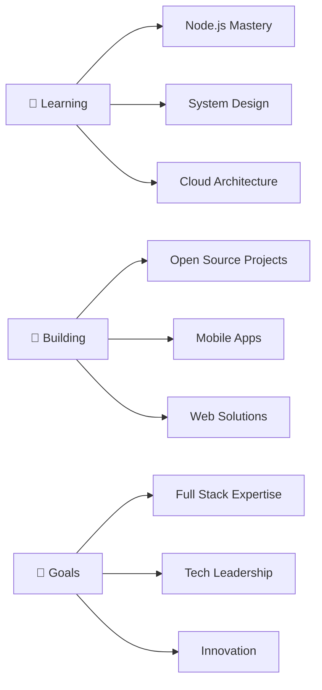

# 🚀 Welcome to My Digital Universe!

<div align="center">
  
</div>

<h1 align="center">
  
  Hi there, I'm <span style="color: #ff6b6b;">TUSHAR MISHRA</span>
  
</h1>

<div align="center">
  
[](https://git.io/typing-svg)

</div>

---
## 🎯 About Me


```yaml
apiVersion: v2.1
kind: Developer
metadata:
  name: Tushar Mishra
  location: India 🇮🇳
  status: Building the future, one line at a time
  
current_mission: 
  🌱 Mastering Node.js & Backend Architecture
  🎯 Contributing to Open Source Projects
  
contact:
  📧 email: mishratushar8890@gmail.com
  💬 motto: "Talk is Cheap, Show me the Code!"
  
experience:
  - company: "goodspace.ai"
    role: "Software Development Engineer"
    achievement: "🏆 Built Goodspace mobile application"
    impact: "Enhanced user experience for job seekers"
    
  - company: "CDAC (MEITY)"
    role: "Software Engineering Intern"
    achievement: "🚀 Developed iVEDA mobile application"
    impact: "Contributed to government digital initiatives"

tech_arsenal:
  mobile: ["Flutter 💙", "Dart 🎯"]
  frontend: ["React.js ⚛️", "HTML5 🌐", "CSS3 🎨"]
  backend: ["Golang 🐹", "Node.js 🟢", "Firebase 🔥"]
  databases: ["MongoDB 🍃", "MySQL 🐬"]
  tools: ["Git 📝", "Docker 🐳", "VS Code 💻"]
```

---

## 🛠️ Tech Stack & Tools
<div align="center">

### 📱 Mobile Development


### 🌐 Web Development


### 🔧 Backend & Databases


### ☁️ Cloud & DevOps


### 🛠️ Tools & Others                     


</div>

---

## 🌟 Connect & Follow

<div align="center">

[](https://twitter.com/tushar2004_)
[](https://linkedin.com/in/mishratushar2004/)
[](mailto:mishratushar8890@gmail.com)


</div>

---

## 📈 GitHub Analytics

<div align="center">


</div>

<div align="center">

</div>

---

## 🎯 Current Focus

<div align="center">


```mermaid
graph LR
    A[🎯 Learning] --> B[Node.js Mastery]
    A --> C[System Design]
    A --> D[Cloud Architecture]
    
    E[🚀 Building] --> F[Open Source Projects]
    E --> G[Mobile Apps]
    E --> H[Web Solutions]
    
    I[🌟 Goals] --> J[Full Stack Expertise]
    I --> K[Tech Leadership]
    I --> L[Innovation]
```

</div>

---

## 🏆 Achievements & Milestones

<div align="center">

| 🎖️ Achievement | 📊 Metric | 🗓️ Year |
|:---:|:---:|:---:|
| **Mobile App Development** | 2+ Production Apps | 2023-2024 |
| **Open Source Contributions** | Growing Repository | 2024 |
| **Professional Experience** | SDE at goodspace.ai | 2024 |
| **Internship Success** | CDAC (MEITY) | 2023 |

</div>

---

<div align="center">
  
</div>

<div align="center">
  
**✨ "Code is like humor. When you have to explain it, it's bad." ✨**

*⭐ From [TUSHAR MISHRA](https://github.com/MISHRA-TUSHAR) with 💙*

</div>

---

<div align="center">

</div>
